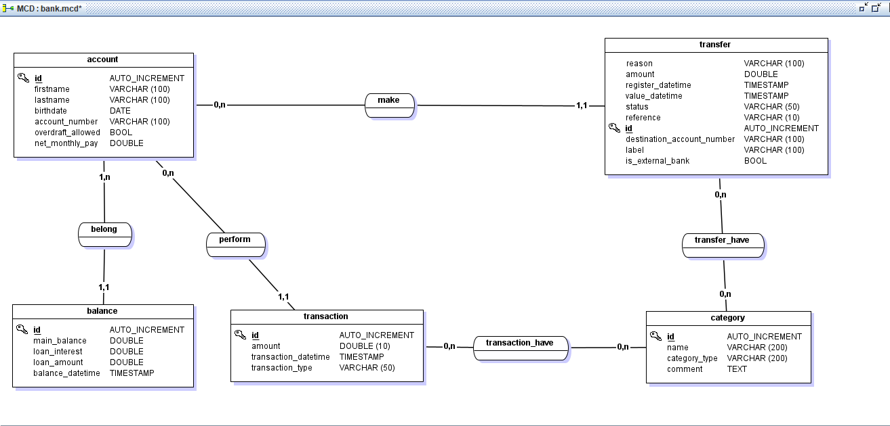

# Numeric bank API
This repository contains an API for a Numeric Bank 
# MCD/MLD
You can view the `MCD` and `MLD`here: [MCD&MLD](./src/main/resources/MCD&MLD)
You can already visualize what look like the **MCD**: 

# DB migration
For this project, we use two script for the database migration. So we need to follow these instructions:
Open a new terminal and go to the directory **db/migration**:
```sh
$ cd src/main/resources/db/migration
```
Well, the next step is running the script:
- for Windows OS, run the command:
```sh
$ db_migration.bat
```
- for Linux OS or macOS, you have to give execution permissions to your script before running it:
 - First of all, if you didn't have create the `prog_admin` user for postgres, run the next command:
   ```sh
     $ sudo -u postgres psql -c "CREATE USER prog_admin WITH PASSWORD 'your_password';"
    ```
 - give the permission:
   ```sh
     $ sudo chmod +x db_migration.sh
    ```
 - run the script
    ```sh
    $ db_migration.sh
    ```
> We use directly the **postgres** as username in the database  

# Project configuration
After doing the database migration, you have to set the env variables with the values:
- **DB_URL**: jdbc:postgresql://localhost:5432/my_bank
- **DB_USERNAME**: {USERNAME}
- **DB_PASSWORD**: {YOUR PASSWORD}

Now, you can run your application
# Openapi specification
You can see the **api specification** in the following link: [API Specification](https://petstore.swagger.io/?url=https://raw.githubusercontent.com/prog4-final-exam/numeric-bank-backend/main/docs/api.yaml)

# Postman Api Collection
You can see the **postman collection** by the next link: [postman collection](https://cloudy-space-468286.postman.co/workspace/Team-Workspace~347dd70c-9202-4392-80ca-15f276bfe525/collection/28557576-0b888708-1be4-4ced-baf3-c7da89f31780?action=share&creator=28557576)